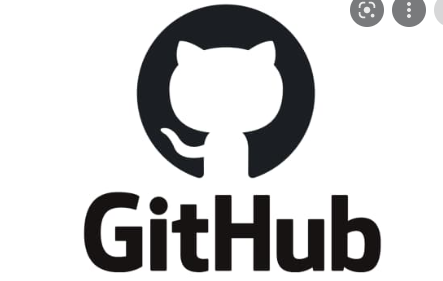

# FATEC-API-2022.2-FALCON
Projeto desenvolvido no 2° Semestre/2022 de BD (Banco de Dados) na Fatec São José dos Campos - Prof. Jessen Vidal

### Equipe:
* PRODUCT OWNER: Lucas Henrique Costa de Oliveira 
* SCRUM MASTER: Lucas Jonathan Cordeiro Gomes 
* DEVELOPER: Lucas Augusto Oliveira de Souza
* DEVELOPER: Lukas Fernando Berto
* DEVELOPER: Igor Cerutti Lima
* DEVELOPER: Matheus Estevam de Castro
* DEVELOPER: Mateus Pereira Cesare
* DEVELOPER: Renato Costa de Moura Mendes

Lucas Henrique Costa de Oliveira | Lucas Jonathan Cordeiro Gomes | Lucas Augusto Oliveira de Souza | Lukas Fernando Berto | Igor Cerutti Lima | Matheus Estevam de Castro | Mateus Pereira Cesare | Renato Costa de Moura Mendes
-----|-----|-----|-----|-----|-----|-----|-----|
PRODUCT OWNER | SCRUM MASTER | DEVELOPER | DEVELOPER | DEVELOPER | DEVELOPER | DEVELOPER | DEVELOPER 
https://github.com/Lucas13Costa | https://github.com/lucasjonathangomes | https://github.com/LucasOliveira321 | https://github.com/LukasFernando |  https://github.com/IgorCerruti96 | - | https://github.com/MateusPCesare | https://github.com/RenatoCMMendes 

## Desafio Proposto:
A instituição de ensino PBLTeX, especializada em cursos práticas de ensino aplicando
PBL (Problem Based Learning) desenvolveu uma dinâmica de **Avaliação
Democratizada** baseada na técnica de Avaliação 360º, porém incluindo uma avaliação
técnica adicional feita pelo Líder do Grupo e uma avaliação de produto/negócio
realizada pelo Fake Client, papel desempenhado por outro instrutor da instituição.
   
A dinâmica criada considera 5 fatores chaves para a realização da avaliação:
* Trabalho em equipe, cooperação e descentralização de conhecimento;
* Iniciativa e proatividade;
* Autodidaxia e agregação de conhecimento ao grupo;
* Entrega de resultados e participação efetiva no projeto;
* Competência Técnica.
   
A instituição tem experimentado algumas soluções de mercado e em uma análise Make
or Buy feita recentemente optou pelo “make”, ou seja, construir uma solução que
viabilize a aplicação dessa dinâmica.
   
O desafio do seu grupo é apoiar a PBLTeX a levantar, especificar e desenvolver uma
solução computacional que viabilize a aplicação dessa técnica

## Cronograma:
(está faltando)

### Planejamento:
(A definir)

### Mockup:
(AJUSTAR FIGMA)
(não quer o link) 
(Colocar o nome da seção vinculando o artefato alvo, ao inves da ferramenta) 
##### https://www.figma.com/file/EMMqbatmZi5srT9ZyphiW8/TELA.API_(desenvolvendo)?node-id=0%3A1

### Backlog do Produto:
(Estruturar corretamente e com as prioridades, de preferencia deixar no .MD)

### Sprint Backlog:
Definido (Colocar link de acesso)

### Vídeo ou gif da aplicação:
(A definir)

### Tecnologias usadas:
Python, figma
(devem ser citadas TODAS as tecnologias usadas)

